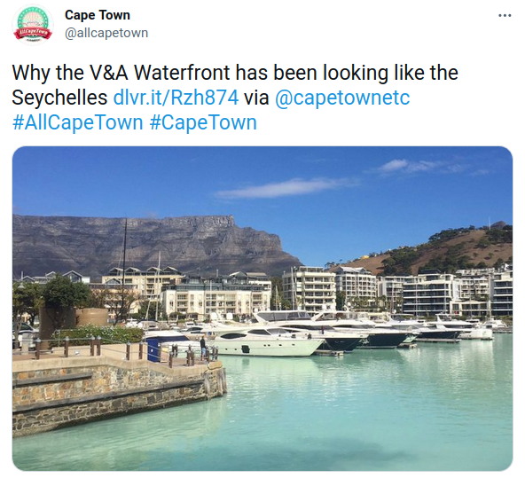
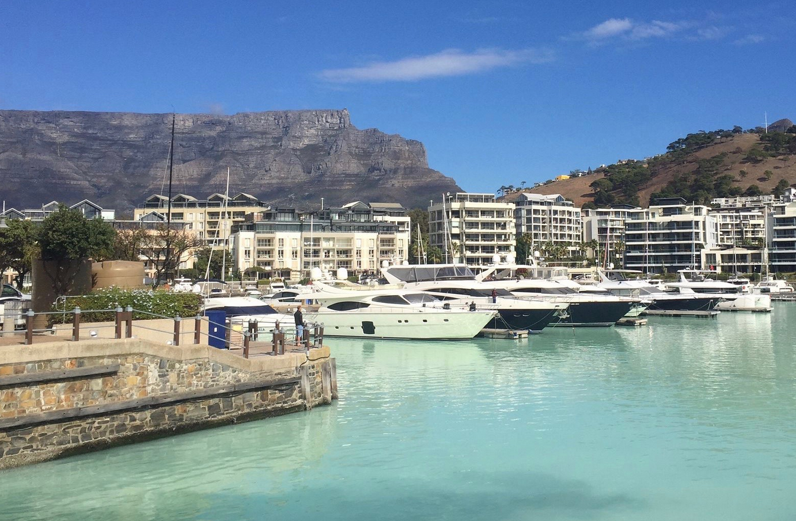
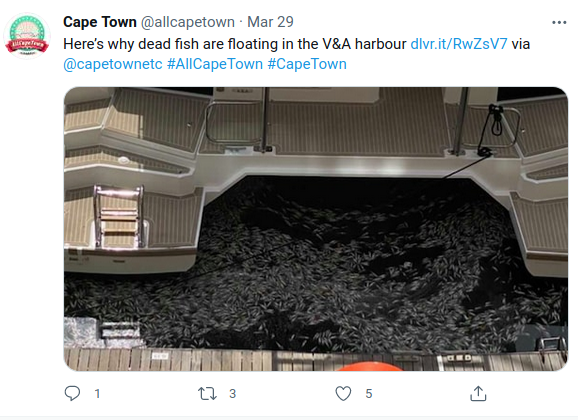
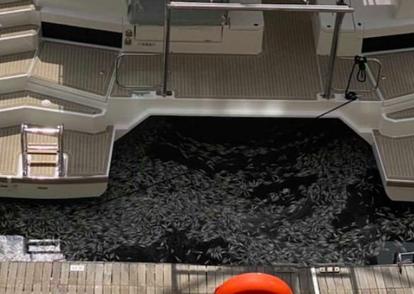
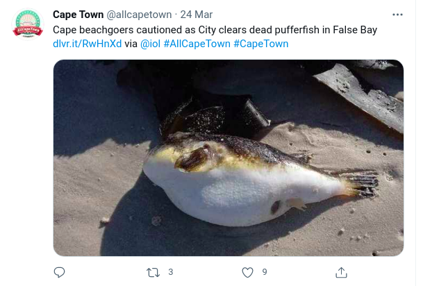
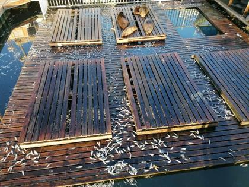
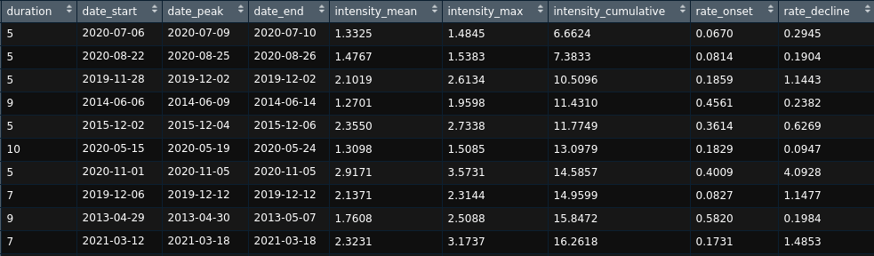
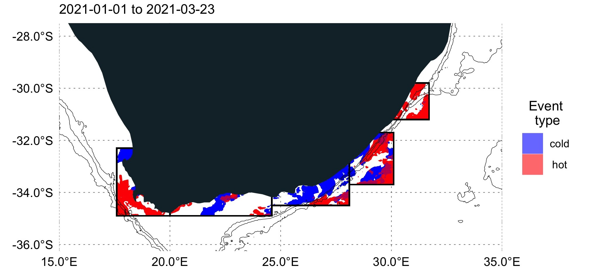
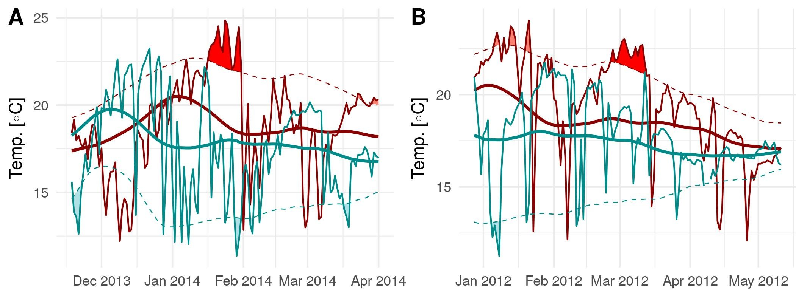

class: title-slide

### Monday munch
# Extreme events


## Amieroh Abrahams

@fathomData

???

* `seal:false` is set in the YAML to override a YAML-generated title page

---
class: no-footer, logo

# The unknown

```{r, echo = FALSE, fig.align = "center", out.width = "45%"}

```
---
class: no-footer, logo

# The unknown

```{r, echo = FALSE, fig.align = "center", out.width = "70%"}

```
---
class: no-footer, logo

# The unknown

```{r, echo = FALSE, fig.align = "center", out.width = "60%"}

```
---
class: no-footer, logo

# The unknown

```{r, echo = FALSE, fig.align = "center", out.width = "60%"}

```
---
class: no-footer, logo

# The unknown

```{r, echo = FALSE, fig.align = "center", out.width = "70%"}

```
---
# The unknown

```{r, echo = FALSE, fig.align = "center", out.width = "50%"}

```
---
## Detecting

* Downloading the data
  * Freely available
  * High resolution
  * SST
  * Chlorophyll
  * Oxygen concentration
---
class: section-slide-orange
## Extreme events
---
## Extreme events?
* Land
  * A period of excessively hot weather
  
* Marine heatwaves (MHW) and marine cold spells (MCS)
  * A short period of abnormally high temperatures in a sea or ocean

* Started seeing MHW affects along the SA coastline between March - May 2021
---
## R package

* Package to produce events dataset
* Package only requires date and temperature column 
* Produces a list of events
---
## R package

```{r, echo = FALSE, fig.align = "center", out.width = "100%"}

```
---
## Plotting metrics
```{r, echo = FALSE, fig.align = "center", out.width = "80%"}

```
---
## Plotting metrics
```{r, echo = FALSE, fig.align = "center", out.width = "100%"}

```
---
class: section-slide-orange
## Animation


